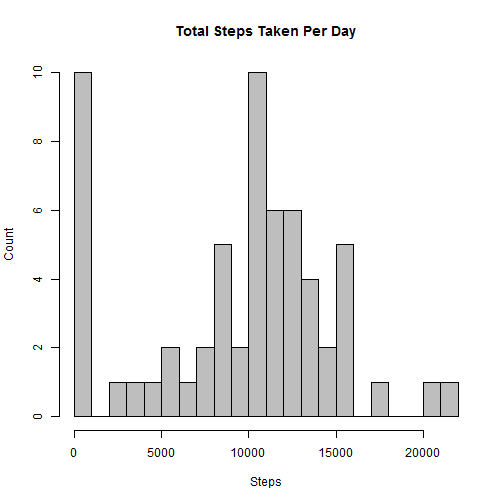
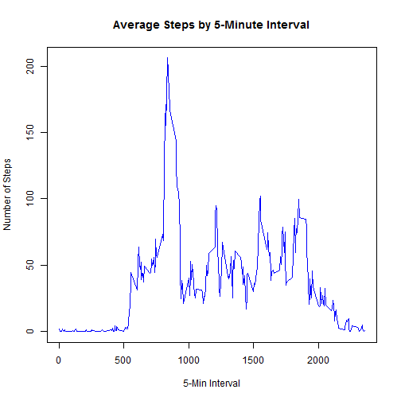
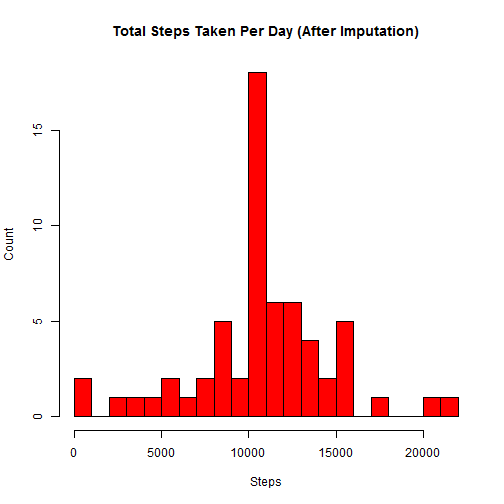
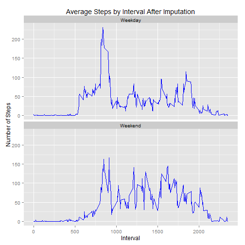

---
title: "Reproducible Research: Peer Assessment 1"
output: html_document
---

This assignment makes use of data from a personal activity monitoring device. This device collects data at 5 minute intervals through out the day. The data consists of two months of data from an anonymous individual collected during the months of October and November, 2012 and include the number of steps taken in 5 minute intervals each day.

## Loading and preprocessing the data


```r
## Load the data
df <- read.csv("./data/repdata_data_activity/activity.csv")

## Process/transform the data into a format suitable for analysis
df$date <- as.Date(df$date)
```

## What is mean total number of steps taken per day?
Ignore the missing values in the dataset for now.


```r
## total number of steps taken per day
daySteps <- aggregate(x=df[1], by=df[2], FUN="sum", na.rm=TRUE)

## A histogram of the total number of steps taken each day
hist(daySteps$steps, breaks=20, 
     main="Total Steps Taken Per Day", 
     xlab="Steps", 
     ylab="Count", 
     col="Grey")
```

 

```r
## Mean of the total number of steps taken per day
mean(daySteps$steps)
```

```
## [1] 9354.23
```

```r
## Median of the total number of steps taken per day
median(daySteps$steps)
```

```
## [1] 10395
```

## What is the average daily activity pattern?


```r
## Time series plot of 5-minute interval and average number of steps
dayInterval <- aggregate(x=df[1], by=df[3], FUN="mean", na.rm=TRUE)

plot(x=dayInterval$interval, y=dayInterval$steps, type="l", 
     main="Average Steps by 5-Minute Interval",
     xlab="5-Min Interval",
     ylab="Number of Steps",
     col = "blue")
```

 

```r
## Interval that contains maximum number of steps across all the days
dayInterval[which.max(dayInterval$steps), 1]
```

```
## [1] 835
```

## Imputing missing values
Note that there are a number of days/intervals where there are missing values (coded as NA). The presence of missing days may introduce bias into some calculations or summaries of the data.


```r
## Checking which variables containing NA
summary(df)
```

```
##      steps             date               interval     
##  Min.   :  0.00   Min.   :2012-10-01   Min.   :   0.0  
##  1st Qu.:  0.00   1st Qu.:2012-10-16   1st Qu.: 588.8  
##  Median :  0.00   Median :2012-10-31   Median :1177.5  
##  Mean   : 37.38   Mean   :2012-10-31   Mean   :1177.5  
##  3rd Qu.: 12.00   3rd Qu.:2012-11-15   3rd Qu.:1766.2  
##  Max.   :806.00   Max.   :2012-11-30   Max.   :2355.0  
##  NA's   :2304
```

```r
## Total number of missing values(NA) in the dataset
nrow(df[is.na(df$steps), ])
```

```
## [1] 2304
```

```r
## Fill in the missing "steps" data with the mean for the 5-minute interval
fixedDf <- merge(x=df, y=dayInterval, by="interval", all.x=TRUE)
fixedDf[is.na(fixedDf$steps.x), 2] <- fixedDf[is.na(fixedDf$steps.x), 4]

## Create a new dataset that is equal to the original dataset but with the missing data filled in
fixedDf <- c(fixedDf[2], fixedDf[3], fixedDf[1])
names(fixedDf)[1] <- "steps"

## total number of steps taken per day (after imputation)
fixedDaySteps <- aggregate(x=fixedDf[1], by=fixedDf[2], FUN="sum", na.rm=TRUE)

## A histogram of the total number of steps taken each day (after imputation)
hist(fixedDaySteps$steps, breaks=20, 
     main="Total Steps Taken Per Day (After Imputation)", 
     xlab="Steps", 
     ylab="Count", 
     col="Red")
```

 

```r
## Mean of the total number of steps taken per day (After Imputation)
mean(fixedDaySteps$steps)
```

```
## [1] 10766.19
```

```r
## Median of the total number of steps taken per day (After Imputation)
median(fixedDaySteps$steps)
```

```
## [1] 10766.19
```
**ANSWER** - 
The mean and median values have increased from the estimated (first part of the assignment) after imputing missing data. The mean and median are now the same.

## Are there differences in activity patterns between weekdays and weekends?


```r
# Create a new factor variable indicating whether the date is a weekday or weekend day 
fixedDf$weekday <- as.factor(ifelse(weekdays(fixedDf$date) %in% c("Saturday", "Sunday"), "Weekend", "Weekday"))

# Average number of steps taken, averaged across all weekday days or weekend days
fixedDayInterval <- aggregate(x=fixedDf[1], by=c(fixedDf[3], fixedDf[4]), FUN="mean", na.rm=TRUE)

library(ggplot2)
ggplot(data=fixedDayInterval, aes(x=interval, y=steps)) + 
    labs(title="Average Steps by Interval After Imputation", x="Interval", y="Number of Steps") +
    geom_line(colour="blue") + 
    facet_wrap(~weekday, nrow=2)
```

 
